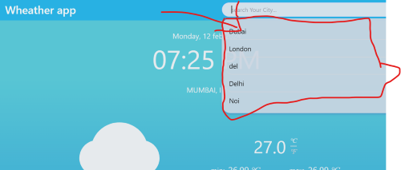
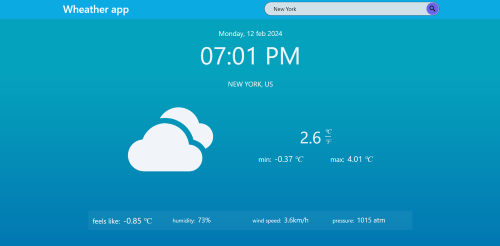
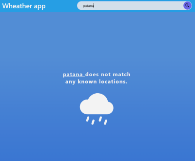
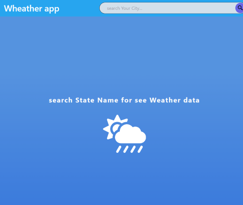

## This weather website 

***it is fetch data from a weather api on the basis of state or any city name of any country.***

 
 

### features
- recent search feature
- changing background color on the basis of temprature.

##### recent search

 
 

##### changing background color 

### not found page - if state or city name is not found 

### if search bar is empty

 

***may be i could show forcast or some other kind of data but i was not able to find that api which can fullfild all requirements***